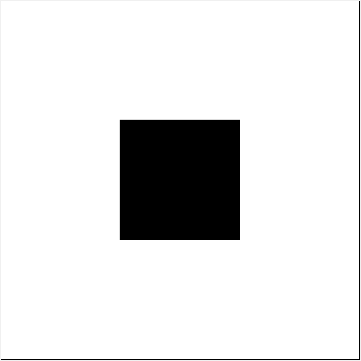
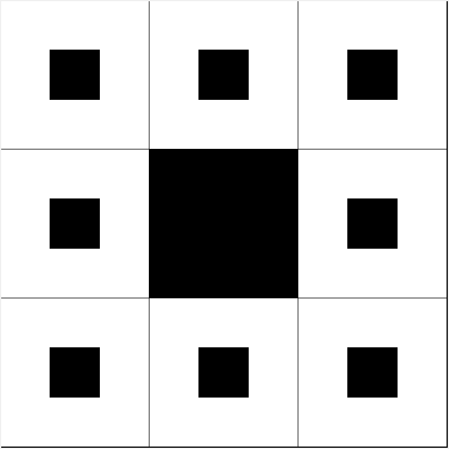
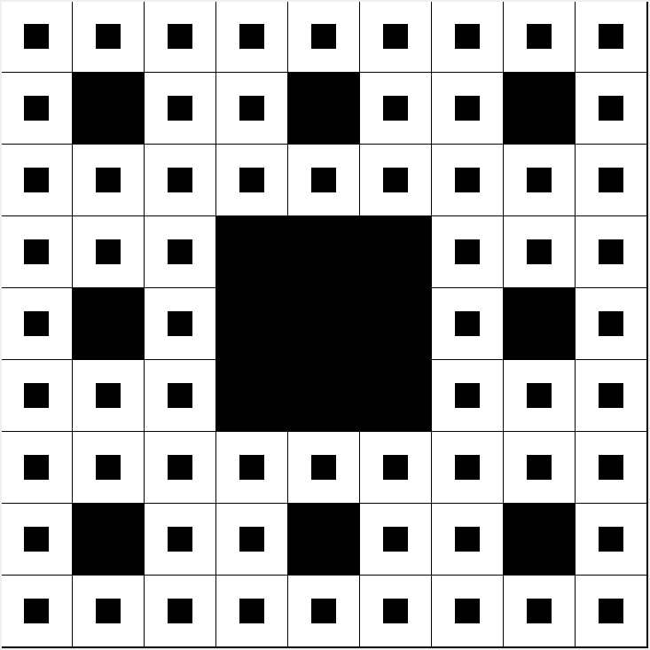
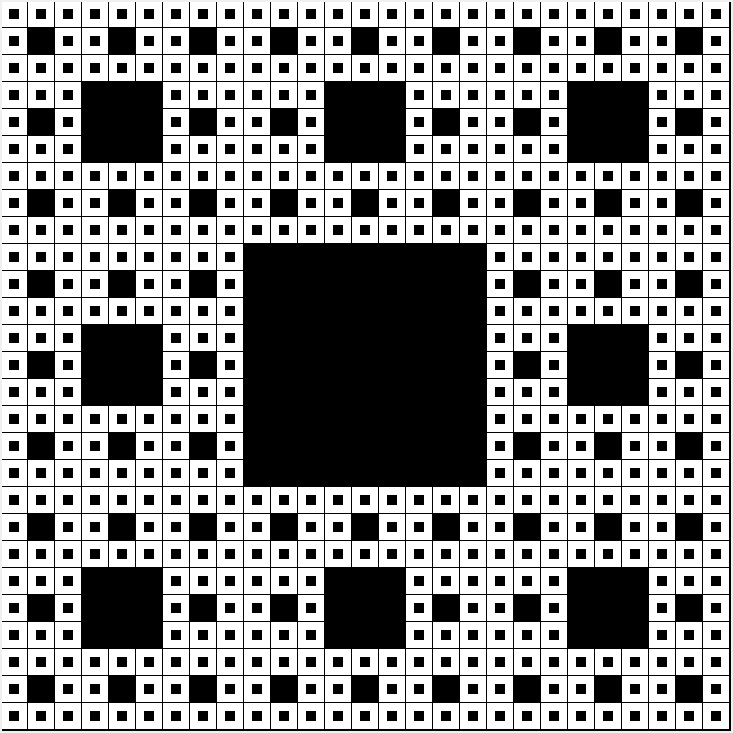
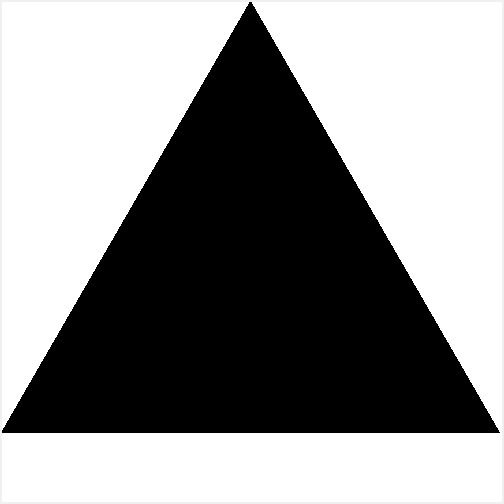
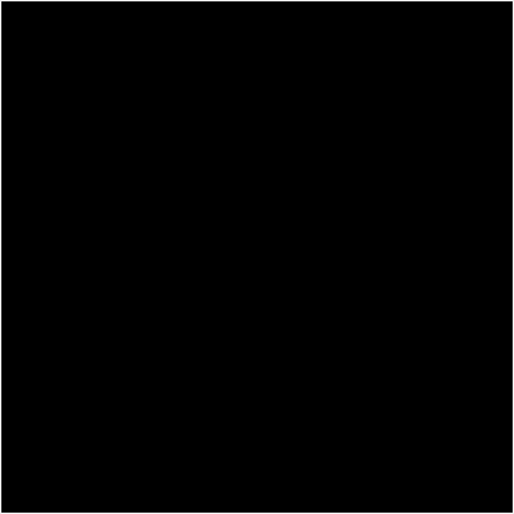

# fractal=practice

### These are the rudiments of a collection of fractal images. It will expand as I learn more about them and the functions that create them.

### The first of these, and the easiest for me to understand, is the Sierpinski carpet. It recurs as the Sierpinski triangle does, but in a more square-shaped way. I call it "rug".

### This collection of images resulted from a function that prints the big black square in the center, then multiplies exponentially smaller versions of that square by powers of 8. The solid black image indicate that the squares have multiplied so many times as to round out the white background.

![]rug.gif

### As with any fractal, the function that draws this is recursive, and won't stop running unless the user manually closes it.
