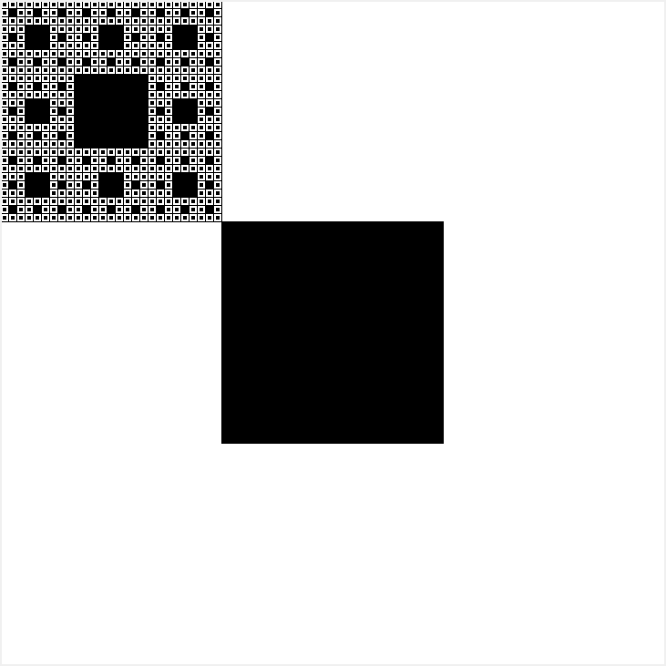
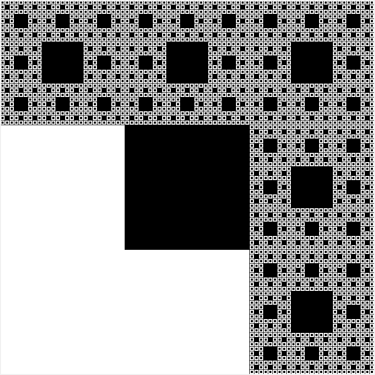
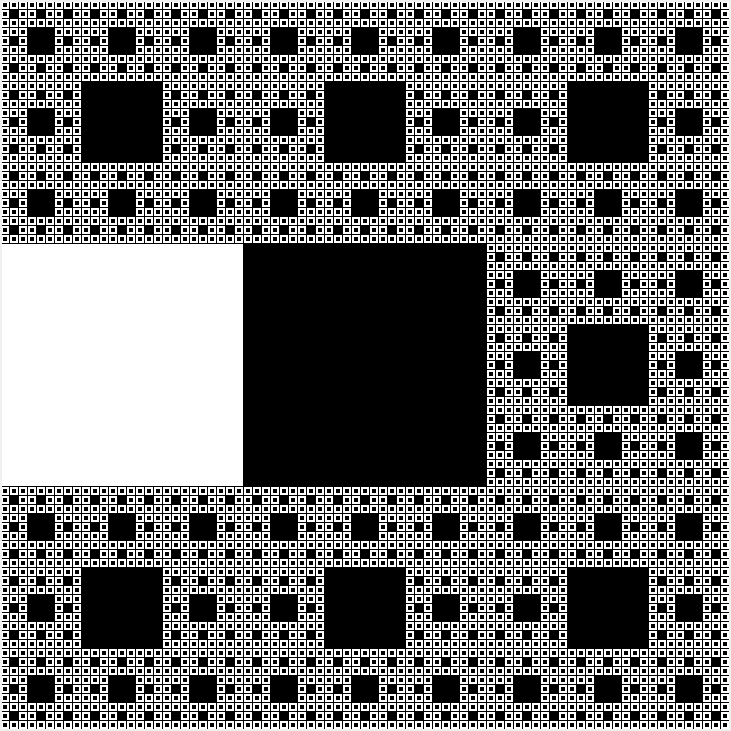
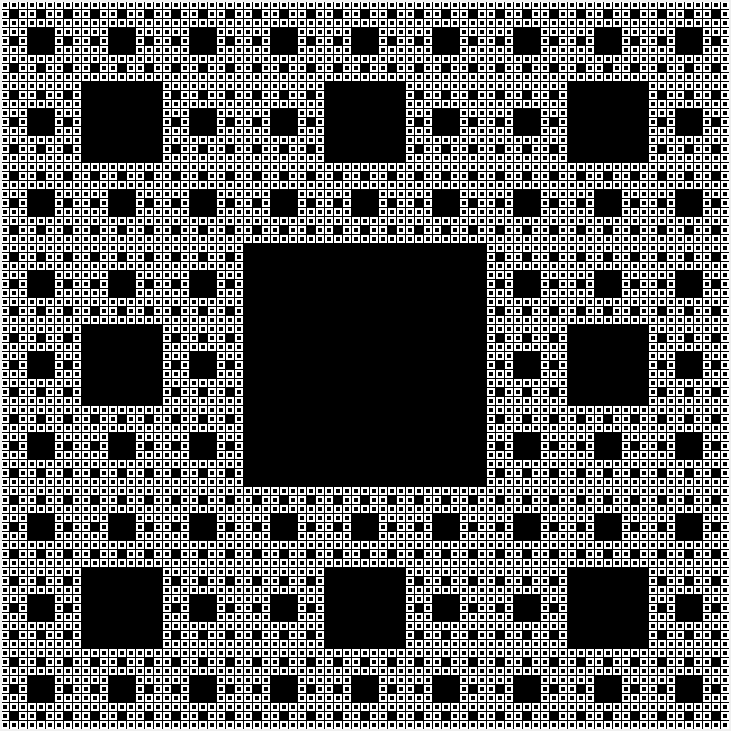

# fractal-practice

##### The function used to take screenshots comes from [a conversation on stackoverflow](https://stackoverflow.com/questions/9886274/how-can-i-convert-canvas-content-to-an-image).

