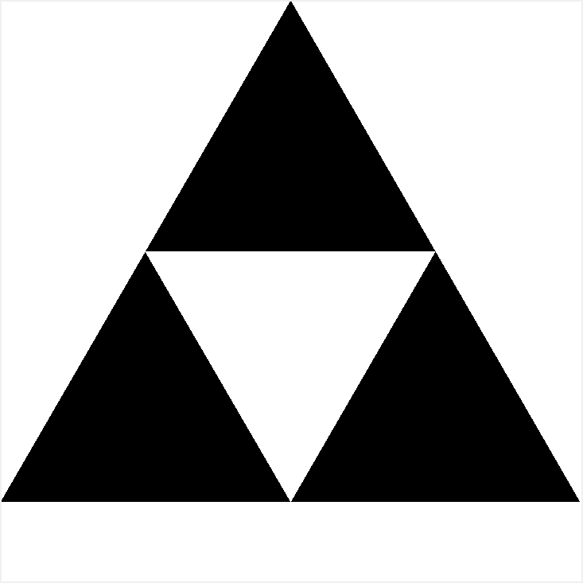

# fractal-practice

##### These are the rudiments of a collection of fractal images. It will expand as I learn more about them and the functions that create them.

##### The first of these, or the easiest for me to understand, is the Sierpinski carpet. It recurs as the Sierpinski triangle does, but in a more square-shaped way. I call it "rug".


##### This animation is the result of a function that prints the big black square in the center, then creates exponentially smaller versions of that square, multiplied by powers of 8. The solid black image indicates that the squares have multiplied so many times as to round out the white background.

##### Before the images displayed layer by layer, the program ran so that each of the eight cells in the layer second from the top would fill with smaller squares before moving to the next cell. The output looked something like this:


##### The above images came from a modification made to the draw function that took a screenshot at every new square drawn. That modification produced 32,768 screenshots.

```python
self.draw(top, top+(height/3), left, left+(width/3), depth+1)
self.c.update()
if depth == self.depth - 1:   # check if depth is actual last depth
  self.screen_count+=1
  self.screenshot(self.c, "output/old_rug_{}.gif".format(self.screen_count))
```

##### rug.py repeats this function eight times, with variables for the coordinates adjusted as needed. The lines of code that take screenshots can be commented out to avoid creating five to six gigabytes' worth of GIF images.

##### After messing around with that method, which sucks up time and hard drive space, [Jean](https://github.com/kobejean) and I created the function that draws each layer one at a time. This required a for loop that never stops repeating, which means the user must manually close the program to terminate it.

##### Another example of this sort of recursion is the Sierpinski triangle.



##### The function for taking screenshots comes from [a conversation on stackoverflow](https://stackoverflow.com/questions/9886274/how-can-i-convert-canvas-content-to-an-image).

